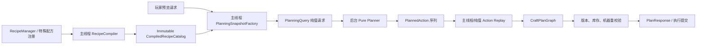

# RSI 配方规划器重设计方案

状态：保守设计评审稿，非实施承诺  
日期：2026-08-08  
适用范围：`rs-integration` 的配方预览、配方树、最大可合成数量和批量合成规划  
基线：当前已提交的配方集成与材料核算修复（`ab5baf6c3db01b7dfd331ab41676fb2e9f21d85d`）

## 当前实现状态（2026-08-09）

当前代码已经完成迁移阶段的第 0--3 步，并增加了保守的通用标签转换 Guard：

- 第 0 步只增加了快照、纯搜索和 typed resolver 的分段计时，没有改变规划语义。
- 第 1 步在提交后台 pure planner 之前执行带库存的需求树走查。走查按物料扣减库存，标签候选使用“存在一个可满足候选”的语义；检测到缺失 producer、环或节点上限时，保守地选择 typed resolver。
- 同一个预览请求只选择一个 planner。pure planner 返回失败结果时不再自动再次调用 typed resolver；异步基础设施异常仍保留原有恢复路径。
- `PureRecipePlanner.Result` 使用 `FEASIBLE/INFEASIBLE/UNKNOWN` 三态；`STEP_LIMIT`、`SEARCH_LIMIT` 和 `TIME_LIMIT` 都属于 `UNKNOWN`。max-craftable 二分遇到未知立即终止，不会把未知当成不可行并静默压低数量。
- 后台 pure planner 使用独立的 500 ms 默认预算，时钟从 worker 出队执行时开始；同一个 max-craftable 请求的所有探测共享这份预算。
- typed 预览使用独立的 200 ms 默认主线程预算。首轮实测显示 50 ms 会误杀耗时约 79--89 ms、且 Guard 已完成候选裁剪的正常复杂仪式，因此默认值提高到 200 ms。超时通过专用异常穿过递归层，在包入口返回本地化 `TIME_LIMIT`，不会再显示成缺少材料。typed planner 不会迁移到后台继续执行。
- 对多候选标签需求启用“无净增益转换”Guard：若一个 crafting 配方消耗的同标签材料不少于其产出，则该配方不能增加这个标签的可用数量，候选会被跳过。选择精确目标转换后，材料族会作为递归分支状态继续保留；即使子需求已收窄成某个具体变体，也不能再次进入同族的无净增益转换。这覆盖羊毛、玻璃、陶瓦、混凝土粉末和木材变体等同类转换，同时保留目标转换本身、`线 -> 白羊毛`、`原木 -> 木板` 和 `混凝土粉末 -> 混凝土` 等有效路径。
- typed resolver 的深度和步数保护命中按单个规划上下文聚合，请求结束时只记录一条包含命中次数和最大观测值的 DEBUG 摘要，不再为每个失败候选重复写日志。
- typed resolver 的请求内材料账本已增加倒排索引和增量 supply journal。精确及可展开标签 Ingredient 不再在每次消耗时复制、排序、扫描整个 RS 库存；嵌套分支也只记录实际修改过的 supply lot，不再为每层递归遍历全部材料来源。这两项优化随库存种类和搜索深度增加而扩大收益，不依赖羊毛、颜色或具体模组白名单。
- 配方树从 DAG 投影视图时，每个逻辑 `graphNodeId` 的上游生产成本只展开一次；同一 producer 向多个下游分配库存时，后续位置保留引用数量但不重复累计其原料。等价配方分支折叠后，相同 Item+NBT 的 unresolved 叶子也会合并并累加缺口，同时仍与已分配材料分开显示。

需求树走查上限是服务端配置 `autoCrafting.craftingPureDemandMaxNodes`，默认 `512`，范围 `64-4096`。它位于服务端配置的 `autoCrafting` 段，与客户端配方树渲染用的 `recipeTreeMaxNodes` 独立。达到上限只会让请求转到 typed resolver，不会把“不确定”误判成 pure 完整。

相关服务端配置为 `autoCrafting.craftingPurePlanningTimeoutMs`（默认 `500`）、`autoCrafting.craftingTypedPreviewTimeoutMs`（默认 `200`）和 `autoCrafting.enableCraftingVariantConversionGuard`（默认开启）。超时和 Guard 结果不写入普通成功缓存。

## 1. 执行摘要

当前规划器已经覆盖普通配方、标签配方和部分第三方特殊配方，但现有测试不足以证明所有覆盖路径都能得到正确结果。搜索阶段承担了过多职责：它同时解析实时 Minecraft 配方对象、分配库存、回滚库存、构造计划 DAG，并为每个候选重复计算成本。遇到 `crafttweaker:summoningrituals.altar.1` 这类候选很多、递归深度大的配方时，单次预览可能耗时 16.9--17.6 秒。

候选方向是“预编译配方目录 + 纯值快照 + 轻量库存账本搜索 + 搜索后构图”的两阶段架构。但这不是把现有 resolver 改名就能完成的重构，能否覆盖某个配方取决于该配方的运行时语义是否可以被证明并完整投影。

1. 在主线程尝试把静态配方和能够证明语义稳定的特殊配方编译成不可变的 `CompiledRecipeAction`。
2. 主线程只采集 RS 库存、网络、机器和配方版本，形成 `PlanningSnapshot`；快照采集本身也必须受成本监控，不能假设为零成本。
3. 后台搜索只操作纯值对象和 journal/savepoint，不触碰 `Recipe<?>`、`ItemStack`、Forge 注册表或世界对象。
4. 搜索成功后，按动作序列确定性重放，第二阶段再生成 `CraftPlanGraph`；任何语义无法重放的结果都拒绝发布。
5. 后台规划使用时间、操作数、步骤数三重预算；预算耗尽返回明确状态，不在同一个请求里同步完整重跑。
6. 服务端提交前重新校验版本、库存和绑定状态；失效结果丢弃，不执行过期计划。
7. 对无法完整投影的配方保留明确的“不支持”结果，而不是承诺通过兼容层自动解决。

该方案借鉴 BetterJEI 的 `RecipeCatalog`、固定点成本、`InventoryLedger` 和有限预算，但不直接搬用其后台访问 Minecraft/Forge 对象的做法。BetterJEI 的性能数字不能直接作为 RSI 的承诺：两者的配方覆盖范围、动态配方数量、RS 库存规模和执行语义不同。

### 1.1 结论的置信度

| 结论 | 当前证据 | 置信度 |
| --- | --- | --- |
| 卡顿主要发生在服务端规划 | 日志中的服务端时间线和客户端响应时间 | 高 |
| 当前请求可能发生纯规划和 typed resolver 双规划 | 现有调用链和源码注释 | 高 |
| 完整纯值目录会显著降低目标配方延迟 | BetterJEI 设计和局部 RSI 代码结构 | 中 |
| 所有第三方配方都能被统一编译 | 尚无覆盖率和 handler 证明 | 低，不应作为前提 |
| P95 小于 500 ms | 尚未有新架构基准 | 未知，不是当前承诺 |

## 2. 问题陈述与证据

### 2.1 用户可见问题

- 打开配方树时明显卡顿，尤其是 CraftTweaker 和多阶段仪式配方。
- 预览等待时间长，但服务端返回结果后客户端实际打开界面只需要约 5 ms。
- 日志中出现“缺少材料：%s护符”或把玩家物品栏里的护符识别成可用材料的情况。
- 标签配方和 RS 内部材料边界不稳定：同一个物品的实体库存、网络库存和标签匹配结果可能被混在一起。

### 2.2 日志基线

从用户提供的 `latest (7).log`、`debug (7).log` 以及游戏日志观察到：

| 场景 | 观察值 |
| --- | ---: |
| `crafttweaker:summoningrituals.altar.1` 单次预览 | 约 16.9--17.6 s |
| 普通配方预览 | 通常约 20--463 ms |
| 服务端结果返回到客户端打开 | 约 5 ms |

这说明主要瓶颈在服务端规划，不在 GUI 绘制、网络传输或配方树渲染。

### 2.3 两次复现的精确时间线

`debug (7).log` 中同一目标连续复现两次：

| 请求 | 客户端发送 | 服务端完成目标步骤 | 规划等待 | 客户端收到响应 |
| --- | --- | --- | ---: | --- |
| 第一次 | 21:40:43.196 | 21:41:00.764 | 17.568 s | 21:41:00.795 |
| 第二次 | 21:41:05.929 | 21:41:22.749 | 16.820 s | 21:41:22.779 |

两次耗时都稳定接近 17 秒，而服务端完成后客户端约 30--36 ms 即收到响应。这种稳定长尾更符合“搜索达到固定状态预算”而非 GUI 卡顿、网络抖动或随机线程排队。

## 3. 当前架构与瓶颈

当前 `RecipeIndex.Entry` 仍保存实时 `Recipe<?>`。特殊配方先经过 typed resolver；搜索过程中还会同时处理以下工作：

- 从实时配方对象提取输入、输出和标签候选。
- 递归查找中间材料的生产配方。
- 创建并回滚 `CraftPlanGraph`、allocation 和 `SupplyLot`。
- 对同一材料的多个候选重复提取、评分和尝试。
- 在异步规划失败或不支持时，同一个请求同步回退完整 resolver。

这些工作叠加后会产生三个问题：

1. **计算重复**：候选配方和材料成本没有在索引阶段固定下来。
2. **回滚昂贵**：搜索分支创建了完整计划结构，而不是只修改小型库存状态。
3. **线程边界不清晰**：实时 `Recipe<?>`、`ItemStack`、Forge 注册对象和世界状态不适合直接跨线程使用。

### 3.1 材料语义缺陷

“护符”问题不能通过简单地把标签扩展成物品列表解决。规划器必须区分：

- RS 网络当前可抽取的真实库存。
- 玩家物品栏或外部容器中的物品，这些不是 RS 材料，除非明确进入网络快照。
- 配方输入的标签语义，例如 `#nameless_trinkets:amulet`。
- 物理槽位语义：某些机器要求输入槽、催化剂槽和容器槽分别提供物品。
- NBT 敏感材料：同一物品 ID 但不同 NBT 不能合并。

因此标签应编译为“匹配谓词 + 快照中的候选物料”，而不是无条件把所有同类物品当作可用库存。

### 3.2 为什么异步版本反而比旧版本慢

本次退化不是普通的线程切换开销，而是异步迁移期间形成了“双规划”路径。

旧版本直接调用完整 typed resolver：

```text
请求
  -> 完整 RecipeIndex / typed resolver
  -> 识别普通配方和 Malum 等特殊生产配方
  -> 构建计划
```

当前版本对可投影目标先运行后台纯规划器：

```text
请求
  -> 只包含 CraftingRecipe 的 ImmutableRecipeGraph
  -> 后台 PureRecipePlanner 搜索
  -> UNRESOLVABLE / STEP_LIMIT / SEARCH_LIMIT
  -> 回到服务端线程
  -> 完整 typed resolver 再规划一次
  -> 构建计划
```

对 `crafttweaker:summoningrituals.altar.1`，目标输入包含 `malum:hallowed_gold_ingot`，其生产路径是 `malum:spirit_infusion/hallowed_gold_ingot`。后者属于特殊配方，不在只投影普通 `CraftingRecipe` 的纯图中。因此后台搜索面对的是不完整的生产图，很可能在大量候选和标签分支中回溯到搜索上限，然后完整 resolver 才找到 Malum 路径。

对应代码位置：

- `GenericCraftPacket` 先提交后台规划：`src/main/java/com/huanghuang/rsintegration/crafting/batch/GenericCraftPacket.java:1937`。
- 纯规划失败后计算同步回退原因：同文件约 `1963` 行。
- 注释明确纯图只包含普通 crafting 配方，失败后重跑 typed resolver：同文件约 `2008` 行。
- `PureRecipePlanner` 当前最多展开 65,536 个状态：`src/main/java/com/huanghuang/rsintegration/crafting/planning/PureRecipePlanner.java:19`。

当前搜索状态本身也偏重。每次展开都会为失败记忆构造 `FailureKey`，复制 pending task 列表、库存 `Map` 和 resolving 集合。高分支配方达到数万状态时，会产生大量哈希计算、短命对象和 GC 压力。当前已增加 500 ms pure 墙钟预算，但预算只能限制最坏等待，不能降低正常搜索的分配率和 CPU 成本。

因此应区分两个指标：

- **服务器响应性**：后台线程可能减少主线程在纯搜索阶段的阻塞。
- **用户端到端延迟**：纯搜索失败后又运行旧 resolver，总等待时间会比旧版本更长。

该问题不能通过增加 worker 数解决。更多线程只会让多个昂贵搜索并行争用 CPU 和内存带宽，单个请求的结果不会更快，服务器整体负载反而可能上升。

### 3.3 长期架构结论

长期方案不应保留“先用不完整纯图试探，失败后再调用旧 resolver”的双规划模型。异步只是规划任务的调度方式，不能改变规划语义，也不能成为另一套候选算法的前置探针。

必须建立以下不变量：

1. **目录完备性**：一个配方进入纯规划目录，必须同时包含它依赖的所有受支持 producer，包括普通配方、机器配方、CraftTweaker 配方和 Malum 等特殊配方；否则该配方被标记为 `UNSUPPORTED_DYNAMIC`，而不是进入一个可能误判的半完整图。
2. **单次语义规划**：一个请求只允许一个 planner 产生最终动作序列。不能因为预算耗尽、纯值投影失败或 replay 失败，再在同一请求中静默执行完整 resolver。
3. **统一动作模型**：typed resolver 和普通配方不再各自维护候选、成本和回滚逻辑；所有 handler 都输出同一种 `CompiledRecipeAction`。
4. **纯值搜索**：搜索状态只包含材料数量、动作引用和 journal 变更，不复制实时 Minecraft 对象或完整 DAG。
5. **明确失败**：目录不完备、动态输出无法确定、搜索预算耗尽和执行校验失败都返回不同的可诊断状态，不伪装成“缺少材料”。
6. **执行独立重校验**：预览结果可以缓存，但执行时必须基于当前 RS 快照重新校验，不能把预览阶段的任意回退路径当作执行保证。

这样 `crafttweaker:summoningrituals.altar.1` 的 Malum 中间配方会在目录编译阶段被纳入同一张图，规划器只搜索一次；如果该特殊配方确实动态到无法编译，则请求在目录阶段就被明确分类，而不会先消耗十几秒做无效搜索。

阶段 1--3 的过渡路由是对“目录完备性”不变量的受控例外：目录不完整时可以直接选择现有 typed resolver，以免立即砍掉当前可用功能；但一个请求仍只能选择一个 planner。该例外必须受 typed 前置条件和独立主线程预算约束，并在统一目录覆盖相应配方族后删除。当前默认预算是 200 ms，可通过服务端配置在 10--500 ms 范围内调整。

### 3.4 “2 秒以内且少改动”的现实边界

不能把一个使用 `ServerLevel`、`ServerPlayer` 和 `INetwork` 的 typed resolver 放到主线程上运行 1.5 秒，然后把这称为性能优化。那会把单玩家等待转化为全服 server tick hitch。

在不重写 typed resolver 的前提下，只有两个诚实选项：

1. **后台纯规划超时即明确失败**：给纯值 planner 设置约 200--500 ms 的墙钟预算，超时返回 `TIME_LIMIT`，不再同步完整回退。端到端延迟可以压住，但复杂特殊配方可能暂时无法预览。
2. **将 typed resolver 改为可暂停 job**：把递归状态、候选游标、`ResolutionContext` 的 journal 和待处理需求显式保存，每 tick 只执行约 20--40 ms，跨 tick 续算。这样可以保留特殊配方成功率，但改动明显大于增加线程或加一个 deadline。

如果业务要求“当前仪式必须成功”且“不能阻塞全服”，第二个选项或完整纯值投影是必要条件；不存在只改路由就同时满足两者的方案。第一轮不应提前实现状态机，除非基准证明确有稳定、受支持的配方需要超过当前 typed 配置上限。

这一节的 2 秒只是用户体验上限，不是 planner 正确性保证。所有超时都必须是三态结果中的 `UNKNOWN/TIME_LIMIT`，不能当作“不可合成”。

现有 `SynchronousFallbackReason` 需要拆清两个概念：后台任务异常、拒绝、取消等基础设施故障仍需要恢复路径；`PURE_UNRESOLVABLE`、`STEP_LIMIT`、`SEARCH_LIMIT` 则是规划结果，不能再被自动解释为“调用另一套 resolver”。

### 3.5 推荐的低改动实施顺序

1. **分段计时硬门禁**：在 `tryBuildPlan` 及后台回调中分别记录快照采集、纯搜索、typed resolver、DAG/响应组装和队列等待。已有 `recordPurePlanningSearch` 与同步回退计数不能替代阶段耗时。没有拆分数据，不改变路由。
2. **快照感知的过渡路由**：投影时只收集“存在未投影 producer 且纯图没有任何 producer 可产出”的孤儿材料；请求时从目标输入做有界 DFS，库存足够的节点剪枝，标签使用存在量词。该路由是迁移脚手架，不是终局目录模型。
3. **先修三态**：修改 max-craftable 探测，使 `UNKNOWN/TIME_LIMIT` 中止整个二分或显式返回未知，绝不当成 `false`。
4. **拆分预算**：pure 使用后台 500 ms 默认预算；typed 使用主线程 200 ms 默认预算，超时返回 `TIME_LIMIT`，不做 1.5 秒同步等待。两者都可配置且互不共享时钟。typed resolver 尚不做跨 tick 状态机，除非计时证明存在大量正当配方需要超过可配置预算。
5. **撤掉搜索失败回退**：只删除 `PURE_UNRESOLVABLE/STEP_LIMIT/SEARCH_LIMIT` 到完整 resolver 的自动回退；`fromAsyncFailure` 对线程异常、任务拒绝和基础设施故障的恢复逻辑保留。

这套顺序的可交付承诺是“预算内成功或明确失败”，不是“目标仪式一定回到几百毫秒”。是否能达到后者必须由第 1 步的实测决定。

## 4. BetterJEI 参考实现分析

已反编译 `D:\sd\rs-integration\libs\betterjei-1.0.2.jar`。其核心思路如下。

### 4.1 值得借鉴的设计

- `RecipeCatalog` 启动或配方重载时预编译普通与特殊配方。
- `PlanAction` 把一次配方执行压缩为输入、输出、配方成本和副产物。
- 成本模型使用固定点整数，避免浮点误差和重复对象分配。
- `InventoryLedger` 只记录库存变更，通过 journal/savepoint 快速回滚。
- 搜索阶段不构造完整 DAG，找到动作序列后才生成可视化计划。
- 最多 24 轮成本传播，避免无限递归。
- 对锭、块、粒等可逆存储配方设置防绕路规则，避免搜索在等价转换之间循环。
- FAST 模式约 500 ms/750,000 次操作，THOROUGH 模式约 5 s/8,000,000 次操作，计划最多 512 步。
- 每个玩家只保留最新请求，使用有界、低优先级线程池和取消标记。

### 4.2 不能直接照抄的部分

BetterJEI 后台仍会携带 `Ingredient`、`ItemStack`、`CraftingRecipe` 等 Minecraft 对象。RSI 面对 Forge 配方重载、第三方动态配方和 RS 网络状态时，直接这样做会产生线程安全和版本一致性问题。

RSI 应只在主线程完成对象投影，后台使用不可变纯值：物品 ID、规范化 NBT、标签 ID、数量、配方 ID、机器类型 ID 和能力标志。动态配方若无法安全投影，应转为受限主线程 handler，而不是让后台反射实时对象。

## 5. 设计目标与非目标

### 5.1 目标

- 对已经完成语义证明和集成测试的配方，预览延迟可测量、可预测，并在目标硬件上达到经基准确定的预算；不对全部模组配方承诺亚秒级响应。
- 服务端 tick 不执行无界递归或完整同步回退。
- 标签、NBT、催化剂、返还物和物理槽位语义保持正确。
- 规划结果与现有 `CraftPlanGraph`、平铺执行链和材料账单兼容。
- 配方重载、网络库存变化、玩家切换和机器绑定变化可靠失效。
- 预算耗尽时返回可诊断、可重试的结果。

### 5.2 非目标

- 不在本阶段重新设计机器 delegate 的实际执行协议。
- 不把所有第三方动态配方强行静态化。
- 不保证任意无限递归配方都能找到全局最优解；优先保证有界、正确、可预测。
- 不把玩家物品栏自动并入 RS 网络库存。
- 不承诺一次性覆盖所有第三方配方；每种特殊配方必须单独完成语义审查和 handler 测试。
- 不把“后台线程完成”当作性能成功标准；端到端延迟、服务端 tick 影响和内存分配必须分别评估。

## 6. 架构总览



请求生命周期：

1. 主线程读取当前网络和配方 revision，生成快照。
2. 后台按快照 revision 搜索动作序列。
3. 搜索成功后确定性重放并构图。
4. 回到主线程检查 request generation、recipe revision、库存 fingerprint、网络身份和机器绑定。
5. 通过校验才缓存和发送结果；否则丢弃并由下一次请求重新规划。

## 7. 领域模型

### 7.1 `CompiledMaterial`

建议字段：


- `ResourceLocation itemId`
- `NormalizedNbt nbt`，无 NBT 时使用 canonical empty value
- `TagSet tags`，只保存编译时已解析的标签 ID
- `MaterialRole role`：`INPUT`、`CATALYST`、`CONTAINER`、`BYPRODUCT`
- `boolean nbtSensitive`

它是规划器中的最小材料键。相等性必须包含物品 ID、规范化 NBT 和必要的槽位语义；不能只按显示名称或物品 ID 合并。

### 7.2 `CompiledIngredient`

```text
CompiledIngredient {
  IngredientKind kind;       // EXACT_ITEM, TAG, PREDICATE
  List<CompiledMaterial> candidates;
  int count;
  SlotRole slot;
  boolean consumes;
  boolean returns;
}
```

标签输入保存为标签 ID 和候选索引。候选只表示“可以匹配”，是否可用仍由 `PlanningSnapshot` 的 RS 库存决定。

### 7.3 `CompiledRecipeAction`

一次动作包括：

- 稳定的 `recipeId` 和 `recipeTypeId`。
- 不可变输入、催化剂、容器和输出列表。
- 机器/处理器 ID 与所需能力标志。
- 输出数量、返还物和副产物。
- 基础成本、优先级、可重复性和是否 NBT 敏感。
- 特殊 handler 的稳定参数，而不是第三方实时对象引用。

### 7.4 `CompiledRecipeCatalog`

目录按输出材料建立候选反向索引，并保存：

- `Map<MaterialKey, List<CompiledRecipeAction>> producers`
- `Map<RecipeId, CompiledRecipeAction> byId`
- 标签到候选材料的索引
- 预计算的最小递归成本和深度下界
- `recipeRevision` 与目录 fingerprint

目录本身不可变。配方重载时构造新目录，完成后一次性替换旧引用。

### 7.5 请求与结果

```text
PlanningQuery {
  UUID playerId;
  MaterialDemand[] roots;
  PlanningSnapshot snapshot;
  PlanningBudget budget;
  long requestGeneration;
}

PlanningResult {
  Status status; // SUCCESS, UNRESOLVABLE, SEARCH_LIMIT, STEP_LIMIT, CANCELLED, STALE
  PlannedAction[] actions;
  Diagnostics diagnostics;
  SnapshotFingerprint fingerprint;
}
```

`PlanningResult` 不直接暴露实时 `ItemStack` 或半成品 DAG。失败结果不得携带部分动作，避免调用方误执行不完整计划。

## 8. 配方目录编译流程

### 8.1 主线程增量构建

1. 监听初次加载和 `/reload`。
2. 读取 `RecipeManager` 中可安全投影的静态配方。
3. 交给每个特殊配方 handler 生成纯值 `CompiledRecipeAction`。
4. 对无法投影的配方登记原因和处理级别。
5. 构建输出反向索引、标签候选索引和成本下界。
6. 发布新目录并递增 `recipeRevision`。

编译过程中旧目录继续服务已存在的请求；新请求使用新目录。不能在目录半成品状态下对外可见。

### 8.2 特殊配方 handler 合同

每个 handler 必须声明：

- 支持的配方类型 ID 和版本范围。
- 是否能在主线程生成完整纯值投影。
- 输入槽位、催化剂、返还物、副产物和动态输出语义。
- 机器能力要求。
- 当参数缺失或输出不确定时的 fail-closed 行为。

handler 不得把 `Level`、`RecipeManager`、实体、容器或第三方配方对象放入编译结果。

### 8.3 动态配方分类

- **A 类：可静态投影**。完整进入目录，走后台规划。
- **B 类：可部分投影**。目录保留稳定输入和候选，最终参数在主线程小范围补全。
- **C 类：完全动态或不支持**。保留原有 typed resolver，但请求必须明确标记为动态，不得在异步失败后对同一请求无条件同步全量重跑。

### 8.4 覆盖判定不能只靠静态集合

静态覆盖闭包不能独立决定请求路由，因为可行性取决于当前 RS 库存和标签候选。过渡路由采用更小的两层模型：

1. `ImmutableRecipeGraphProjector` 遍历 `RecipeManager` 时顺手收集孤儿材料：至少存在一个未投影 producer，并且纯图中不存在任何 producer。该集合只做单趟归并，不做固定点传播。
2. 请求快照建立后，从目标输入做有界需求树 DFS；库存已满足的材料立即剪枝，标签输入采用存在量词：只要当前快照中有一个可用且完整的候选，就不因为同标签的其他候选动态而污染该分支。

如果标签的纯候选在快照中不存在，而唯一可用候选来自未投影 producer，则该请求不能走纯 planner。它应进入可暂停 typed job 或返回 `UNKNOWN/UNSUPPORTED_DYNAMIC`，不能用静态集合强行判定完整。

这个两层判定比单个 O(1) 集合更复杂，但走查规模是需求树而不是完整搜索空间，能避免大标签把数千个配方永久标成不完整，也避免库存已有 `malum:hallowed_gold_ingot` 时无谓地依赖 Malum producer。DFS 设置几百个节点的独立上限；超限保守选择 typed 或明确失败，不进入纯搜索。

孤儿集合和 DFS memo 必须使用与 planner 一致的完整材料键，包含必要的 NBT/精确匹配语义，不能只按裸 `Item`。memo key 还必须包含需求数量及会改变候选集合的上下文；至少不能跨 `effectiveOverrides`、NBT 约束或不同标签需求复用同一判断。DFS 必须有 visiting 集合处理循环，遇到无法证明可终止的环返回模糊结果，不能递归到节点上限后误判完整。

## 9. 成本模型

使用 `long` 固定点成本，推荐以统一的 1/1024 cost unit 表示。

```text
actionCost = baseRecipeCost
           + sum(inputCost(material) * count)
           + machinePenalty
           + dynamicPenalty
```

规则：

- 原始 RS 库存成本最低，网络中已有物料优先消耗。
- 配方基础成本按配方类型和机器能力设置，不把运行时机器可用性伪装成静态成本。
- 玩家明确选择的 preferred recipe 作为强覆盖；普通候选只按成本和稳定 tie-break 排序。
- 返还物和催化剂按角色建模，不能当作普通一次性输入。
- 成本只用于排序和剪枝，不单独决定可行性；库存、槽位和 NBT 校验具有更高优先级。

成本传播最多固定 24 轮，超过传播上限的材料标记为未知下界，搜索仍受预算保护。

## 10. 搜索算法

### 10.1 轻量库存账本

后台只复制快照中的数量表：

```text
InventoryLedger {
  Map<MaterialKey, Long> available;
  JournalEntry[] journal;
  Savepoint mark();
  void rollback(mark);
  void commit(mark);
}
```

尝试一个候选时只记录数量变化和动作引用；回溯通过 journal 截断完成，不创建 DAG、`SupplyLot` 或 GUI 节点。

### 10.2 搜索步骤

1. 从尚未满足的 root demand 中选择最难满足的一项：候选数少、NBT 敏感或下界成本高者优先。
2. 先消耗快照中已存在的精确材料，再尝试标签候选。
3. 对候选动作按 preferred recipe、可行性下界、成本、recipe ID 做稳定排序。
4. 建立 savepoint，扣除输入，加入输出和返还物，递归处理新需求。
5. 失败则 rollback 并尝试下一个候选。
6. 所有 root demand 满足后返回动作序列。

### 10.3 循环和可逆转换

维护当前递归路径的 `MaterialKey` 和 `recipeId` 集合。发现同一路径重复时立即剪枝。

对锭/块/粒、压缩/解压、相同产物的可逆转换设置 guard：只有能降低当前净需求、填补明确槽位或满足用户 preferred recipe 时才允许进入。否则禁止在等价材料之间绕路。

### 10.4 标签、NBT 和护符语义

- 标签只作为匹配关系，不能直接创造库存。
- `#nameless_trinkets:amulet` 的输入必须从 RS 快照中寻找匹配条目。
- 玩家物品栏中的护符不计入 RS 库存，除非该物品已经被抽入网络并出现在快照中。
- 同一物品 ID 的不同 NBT 分开记账；如果配方要求特定 NBT，通用护符不能替代。
- 一个物理槽位只能由一个动作输入占用；不能因为标签候选相同就复用同一个实际物品。

### 10.5 催化剂、返还物和副产物

每个输入明确记录 `consumes`。催化剂消耗量为零但必须验证存在；返还物在动作完成后写回账本；副产物作为独立输出需求或可选库存，不能静默丢弃。

### 10.6 三重预算和取消

纯规划和 typed job 使用不同资源预算，不能合并成一个“全请求 1,500 ms”数字：

- pure 当前默认预算：后台 500 ms，并继续受搜索状态数和步骤数上限约束。
- typed resolver 当前默认主线程预算：200 ms；它是协作式保护网，不是允许主线程连续运行 1.5 秒的目标。该值来自真实整合包中正常复杂仪式约 79--89 ms 的首轮数据，并留有约一倍余量。
- 服务端配置允许更低上限；任何一个上限先到即停止。
- 若未来增加 THOROUGH 模式，只能扩大后台纯规划预算，不能扩大主线程 typed 预算。

每展开固定数量的节点检查取消标记、玩家连接状态和 request generation。取消、过期和预算耗尽都返回明确状态，不进入同步全量回退。

typed 预算是协作式上限，不是可抢占的硬实时保证。deadline 检查必须放在递归入口、候选循环和第三方 handler 调用边界；如果单个第三方调用自身阻塞超过预算，resolver 无法中途抢占，只能记录实际超限并据此决定是否禁用对应 typed 路径。

### 10.7 可行性三态和最大可合成数量

`feasible == false` 不能同时表示“确实不可行”和“本次不知道”。纯 planner 的结果必须至少区分：

```text
FEASIBLE       // 已找到计划
INFEASIBLE     // 在完整覆盖域内证明库存/配方不可满足
UNKNOWN        // TIME_LIMIT、CANCELLED、目录不完整或动态值不确定
```

`AsyncMaxCraftablePlanningService` 的二分探测遇到 `UNKNOWN` 时必须终止本次搜索并返回“未知/需要重试”，不能调用 `search.accept(count, false)` 继续压低上界。每次 probe 可以共享请求取消标记，但时间预算必须明确是“每 probe”还是“整个 max-craftable 请求”；推荐整个请求有总预算，同时对单 probe 设最小预算。

超时提示必须通过 `Component.translatable(...)` 生成，不能在服务端调用 `.getString()`。专用服务端不应依赖本地语言资源把 key 提前格式化成文本。

## 11. 动作序列到 DAG 的第二阶段

搜索阶段只输出有序 `PlannedAction[]`。成功后按相同目录 revision 和相同快照执行确定性 replay：

1. 重新创建空的 `CraftPlanGraph` builder。
2. 按动作顺序分配输入材料和 root demand。
3. 写入催化剂、容器、返还物、副产物和机器节点。
4. 写入 allocation、root demands 和 secondary outputs。
5. 运行 `CraftPlanValidator` 和执行等价校验。

replay 失败说明 planner 或编译目录存在 bug，必须记录诊断并 fail-closed；不应悄悄换另一套计划，以免预览和执行语义不一致。

## 12. 异步边界

### 主线程允许做的事

- 读取 `RecipeManager`、Forge 注册表、RS 网络库存和机器绑定。
- 生成 `PlanningSnapshot` 和 `CompiledRecipeCatalog`。
- 对动态配方做小范围补全。
- 接收后台结果、重校验并提交或发送响应。

### 后台允许做的事

- 读取不可变目录和快照。
- 操作纯值 `InventoryLedger`、成本表和动作数组。
- 生成不可变 `PlanningResult`。

后台禁止访问 `Level`、`ServerPlayer`、`RecipeManager`、实时 `ItemStack`、容器、世界实体和第三方反射 API。

## 13. 缓存与失效

缓存 key 至少包含：

- 网络身份和维度。
- 玩家权限/配方可见性版本。
- root demand、preferred recipe 和规划模式。
- `recipeRevision`。
- RS 库存 fingerprint。
- 机器绑定和能力 fingerprint。

以下事件使相关缓存失效：配方 `/reload`、网络库存变化、机器绑定变化、玩家离线、权限变化、请求 generation 更新和目录 fingerprint 改变。

缓存值必须是不可变响应草稿；不得缓存可被后续代码修改的 `ItemStack`、数组或集合引用。

`TIME_LIMIT`、`UNKNOWN`、`CANCELLED` 和目录不完整结果默认不写入普通成功缓存。若为了抑制重复点击而缓存失败，只允许极短 TTL，并且库存 fingerprint、recipe revision 或请求 generation 变化时立即失效。`PlanCache.Entry.purePlan` 为空是合法状态，读取路径必须显式支持 typed/纯规划两类响应，不能把 null 当作成功的纯计划。

## 14. 调度与并发

- 每个玩家只保留最新规划请求，旧请求取消并从等待队列移除。
- 使用有界、低优先级线程池；默认建议 4 个 worker、队列 64，具体值由配置控制。
- 队列满时返回可重试状态，不在服务端线程同步计算。
- 预览请求和执行请求共享目录，但执行提交必须重新校验库存，不能直接复用预览时的扣减结果。
- 同一玩家的结果按 generation 严格排序，旧结果不能覆盖新缓存。

### 14.1 队列时间与 deadline

请求的墙钟预算从 worker 真正出队、开始执行纯计算时起算，不应把有界队列中的排队时间算进 planner deadline。队列深度达到阈值时，应在入队前返回 `planner_busy` 或降低优先级；不能让请求排队后只剩几毫秒而全部变成伪 `TIME_LIMIT`。

### 14.2 路由判据必须完整

任何“只选择一个 planner”的路由都必须同时检查：

- 目标及递归依赖是否处于同一覆盖域。
- `forcedRecipes`/preferred recipe 是否为空；有强制候选时不能先丢弃纯规划结果再触发第二次规划。
- `PlanningSnapshot.mainThreadOnly()`。
- `ENABLE_MULTIBLOCK_AUTO_CRAFTING` 和 `network != null` 等 typed resolver 前置条件。
- 目标是否需要物理机器槽位、动态输出或运行时选材。

若 typed 前置条件不满足，路由必须返回明确失败状态，而不是进入一个永远不会填充 `resolutionSteps` 的分支。

路由关系应写成互斥决策，而不是多个后置 `if`：

```text
pureEligible  = demandTreeComplete
                && effectiveOverrides.isEmpty()
                && !mainThreadOnly
typedAvailable = ENABLE_MULTIBLOCK_AUTO_CRAFTING && network != null

if pureEligible       -> PURE
else if typedAvailable -> TYPED
else                   -> UNSUPPORTED_DYNAMIC / NO_NETWORK / FEATURE_DISABLED
```

## 15. 可观测性

每个请求记录 request ID、recipe revision 和 snapshot fingerprint，并输出结构化指标：

- catalog build：配方数、成功投影数、动态/拒绝数、耗时。
- candidate lookup：目标、候选数、标签展开数、缓存命中。
- search：操作数、深度、回溯次数、失败缓存命中、预算耗尽原因。
- replay/DAG：动作数、节点数、分配数、校验耗时和失败原因。
- total：排队耗时、后台耗时、主线程提交耗时、最终状态。

日志中必须打印稳定 recipe ID 和材料 key；显示文本中的 `%s` 只在最终本地化层格式化，不能把未格式化占位符当材料名返回。

## 16. 配置项建议

建议新增或统一以下服务端配置：

```text
planner.maxWorkers = 4
planner.queueCapacity = 64
planner.pureTimeBudgetMs = 1000
planner.typedMainThreadBudgetMs = 200
planner.pureOperationBudget = 750000
planner.maxSteps = 512
planner.routeTraversalMaxNodes = config.autoCrafting.craftingPureDemandMaxNodes (default 512, range 64-4096)
planner.maxCostPropagationRounds = 24
planner.searchStateLimit = 65536
planner.failureCacheLimit = 8192
planner.transientFailureTtlMs = 0
planner.dynamicRecipePolicy = MAIN_THREAD_BOUNDED | LEGACY_REJECT
```

配置值必须有硬上限，尤其不能允许配置把主线程 typed 预算提高到秒级。上述数字是待实测的初值，不是发布默认值。

## 17. 迁移计划

本计划只有通过以下门槛才应继续扩大范围：

| 门槛 | 必须取得的证据 | 未通过时的决定 |
| --- | --- | --- |
| A：瓶颈归因 | 分阶段计时证明主要耗时确实来自纯搜索/双规划，而不是快照、索引 warm-up 或其他模组线程争用 | 停止 planner 重构，重新定位热点 |
| B：领域模型可表达 | 原版 crafting、目标 CraftTweaker 仪式、Malum producer、标签护符和催化剂均能无损表示并 replay | 缩小覆盖域；不能用特例字段污染通用模型 |
| C：性能原型 | 在用户整合包副本上，目标用例的端到端延迟、主线程时间和分配率均明显改善 | 不进入生产迁移，重新评估搜索算法和目录粒度 |
| D：维护可承受 | handler 数量、版本矩阵、测试 JAR 和负责人明确 | 不承诺对应模组覆盖 |
| E：执行等价 | 新旧材料账单、DAG、催化剂/返还物及失败补偿通过差分和真实服务端测试 | 不启用该覆盖域 |

这里的“明显改善”需要在阶段 0 根据目标硬件定义，不能在缺少基准时预设百分比。通过一个目标配方也不能证明架构适合全部配方族。

### 阶段 0：建立可持续的观测基线

只提交分段打点，不改变路由、预算或结果语义。为快照采集、纯搜索、typed resolver、动作 replay、DAG/响应组装和队列等待分别计时，并关联 request ID、recipe ID、pure status 和 fallback reason。先在用户整合包复现目标仪式；只有纯搜索占据主要耗时时才进入阶段 1，否则停止路由方案并重新定位 typed resolver、配方图构建或标签展开。

### 阶段 1：快照感知的单次规划路由

投影时单趟收集孤儿材料，请求时执行有界需求树 DFS。路由判据必须同时包含需求树完整性、`effectiveOverrides.isEmpty()`、`!mainThreadOnly()` 和 typed 前置条件。纯规划与 typed resolver 二选一；搜索失败不再触发另一套 planner。路由无法选择可用后端时返回明确状态。

### 阶段 2：修正可行性三态

在任何 `TIME_LIMIT` 落地前，把 `FEASIBLE`、`INFEASIBLE` 和 `UNKNOWN` 贯穿 `PureRecipePlanner.Result`、max-craftable 二分、网络响应和缓存。二分遇到 `UNKNOWN` 立即中止并返回未知，不能静默压低最大可合成数量。

### 阶段 3：分资源 deadline

从 worker 出队时启动 pure deadline，当前默认 500 ms；typed resolver 在进入主线程计算时启动独立 deadline，当前默认 200 ms。两者分别记录耗时和超时。`TIME_LIMIT` 不进入普通缓存，提示使用 `Component.translatable(...)`。这一阶段不实现跨 tick 状态机，也不把持有 `ServerLevel`、`ServerPlayer`、`INetwork` 和实时配方对象的递归调用栈迁移到后台。

### 阶段 3A：通用标签转换 Guard

在 typed 候选验证阶段，对多候选标签需求计算配方的标签内净增益。仅当配方消耗的同标签材料数量不少于其产出、且 NBT/返还物语义可明确判断时才剪枝；不依赖羊毛、颜色或木材名称白名单。精确物品需求不应用该剪枝，因此需要红色羊毛时仍允许直接染红；递归处理其 `#wool` 输入时，蓝色羊毛再染成其他颜色这类零净增益绕路会被排除。识别不确定、动态配方或 NBT 敏感输入保持原候选集合，由 deadline 兜底。

### 阶段 3B：typed 请求内材料索引

`ResolutionContext` 按 Item 建立可用 StackKey 倒排索引、按 MaterialKey 建立 supply-lot 索引。普通精确 Ingredient 和可展开标签只访问可能匹配的键；动态/NBT Ingredient 无法证明候选完备时仍回退到全量权威匹配。事务回滚使用变更 journal，`beginUndo` 不再为每个递归分支给全部 supply lot 建检查点。该优化不改变候选顺序、材料来源、NBT 匹配或嵌套回滚语义。

### 阶段 4：统一材料和配方领域模型

实现 `CompiledMaterial`、`CompiledIngredient`、`CompiledRecipeAction`、recipe fingerprint 和标签/NBT/物理槽位规则。旧 resolver 可以继续作为差分基准，但候选匹配必须经过同一套材料语义测试。

### 阶段 5：构建按覆盖域完备的 `CompiledRecipeCatalog`

不能合理假设全局目录能够覆盖整合包中的全部配方。应按配方族定义覆盖域，例如“原版 crafting + Malum spirit infusion”，只有当目标及其递归 producer 全部处于同一已验证覆盖域时才允许进入 planner。handler 只能返回不可变纯值；无法证明输出稳定性的配方明确标记动态。目录发布采用 revision 原子替换。

### 阶段 6：实现单一纯值 planner

将候选排序、固定点成本、journal/savepoint、循环检测、可逆转换 guard、催化剂和副产物语义集中到一个 planner。预算耗尽只产生明确结果，不触发另一套 planner。

### 阶段 7：确定性 replay 和 DAG 编译

planner 输出动作序列；replay 使用同一目录和快照确定性生成 `CraftPlanGraph`。replay 失败视为目录或 planner 缺陷，记录诊断并拒绝结果，不调用旧 resolver 偷换计划。

### 阶段 8：异步协议、缓存和执行提交

主线程采集快照，后台只读纯值；结果返回后重验 recipe revision、RS 库存 fingerprint、网络身份、机器绑定和请求 generation。缓存和执行提交都使用同一套 fingerprint 校验。

### 阶段 9：移除过渡路由和旧预览 fallback

当特殊配方逐步进入统一目录后，孤儿集合和需求树路由的命中率应持续下降。最终旧 typed resolver 只保留为差分测试工具或明确的执行兼容适配器，不再作为预览请求的隐式 fallback；不支持的动态配方返回 `UNSUPPORTED_DYNAMIC`。

迁移期间可以运行影子差分测试，但影子结果不能在生产请求中再次触发完整规划。

## 18. 测试方案

### 单元测试

- 精确物品、标签、NBT 和物理槽位匹配。
- RS 库存与玩家物品栏隔离。
- 催化剂不被消耗，返还物正确回写。
- 可逆转换 guard 和递归循环检测。
- journal savepoint 的 commit/rollback。
- replay 生成的 DAG 通过 `CraftPlanValidator`。

### 性质与差分测试

- 固定种子生成小型 DAG，与独立广度优先穷举器比较可行性。
- 成功动作序列重放后，剩余库存和 root demand 必须一致。
- 新旧 resolver 在支持范围内比较 recipe ID、材料账单、步骤语义和执行等价性。
- 需求树走查访问数达到 `craftingPureDemandMaxNodes` 时必须返回 `NODE_LIMIT` 并路由 typed，不能栈溢出或把未知判成完整；pure planner 的搜索上限仍单独返回 `SEARCH_LIMIT`。

### 性能与集成测试

- 目标 `summoningrituals.altar.1`、标签护符配方、多阶段仪式和高分支配方。
- 服务器 tick 线程阻塞监控。
- 配方 reload、网络库存变化、玩家断线、机器绑定变化期间的过期结果丢弃。
- Forge 服务端 smoke test：真实 RS 网络、真实机器 delegate、真实执行事务和失败回滚。

## 19. 验收标准

以下指标按冷缓存和热缓存分别测量：

- 已覆盖配方的 P95 由代表性整合包、目标硬件和冷/热缓存基准共同确定；500 ms 只能作为初始试验目标，不是全体配方的承诺。若预算耗尽，必须在预算内返回明确失败，不能继续卡住。
- 客户端收到成功响应后打开配方树小于 50 ms。
- 规划期间服务端 tick 无明显长尾阻塞。
- 任何仍使用实时 `ServerLevel`/`ServerPlayer`/`INetwork` 的 typed resolver，当前默认使用 200 ms 主线程预算并记录每次超时；不能用 1.5 秒同步 deadline 作为替代。只有基准证明存在大量正当配方超过可配置上限时，才立项做 20--40 ms/tick 的可暂停状态机。
- 单个请求不得在纯规划失败或预算耗尽后再执行第二套完整 resolver。
- 所有进入纯规划的目标及其当前快照选择的递归依赖都必须存在于同一份 `CompiledRecipeCatalog`；静态集合只能作为肯定判据，模糊标签必须经过快照走查。
- 过渡路由允许目录不完整请求直接选择一次 typed resolver，以保留现有功能；它满足“单次语义规划”但不满足终局“目录完备性”，必须有命中率指标和删除阶段，不能演化成永久双系统。
- `crafttweaker:summoningrituals.altar.1` 在其依赖 producer 完成语义覆盖后，不再出现约 16.8--17.6 秒的固定长尾；在覆盖完成前应明确标记为未支持，而不是用半完整图给出误导性结果。
- `TIME_LIMIT/UNKNOWN` 不会被 max-craftable 二分当作 `false`，也不会进入普通成功缓存。
- 多候选标签中的零净增益转换不会进入递归搜索；精确变体目标、真正增加标签数量的 producer 和跨材料族单向转换仍可用。
- 在改变路由前，`PerformanceMonitor` 必须能分别给出纯搜索、typed resolver、快照、DAG 组装和队列等待耗时；没有拆分数据不得宣称已找到收益来源。
- 支持范围内新旧计划语义一致，标签/NBT/催化剂/返还物测试全部通过。
- 过期或取消结果不会写入缓存、发送给客户端或启动执行。
- 日志能定位 recipe ID、材料 key、预算类型和回退原因。

## 20. 风险、缺点与缓解

### 20.1 预编译目录占用内存

不可变索引会增加常驻内存。缓解方式是共享材料键、压缩标签候选、限制动态元数据，并在 reload 时原子替换旧目录。

### 20.2 静态投影与真实运行时不一致

第三方机器可能根据世界状态改变输出。handler 必须显式声明动态能力；无法证明等价时走 B/C 类，不伪装成静态配方。

### 20.3 有界搜索不保证找到最优解

预算优先保证服务器响应性。通过 preferred recipe、稳定候选排序、成本下界和 THOROUGH 模式提供可控的更深搜索；结果中记录是否达到预算上限。

### 20.4 两阶段 replay 可能暴露 planner bug

这是有意的保护边界。replay 失败应暴露诊断并阻止执行，而不是发送一个与搜索不同的隐式计划。差分测试和 handler 合同用于降低该风险。

### 20.5 标签候选数量膨胀

标签索引按标签 ID 预构建，并在快照阶段只保留 RS 中实际存在且满足 NBT/槽位要求的候选。候选展开设上限，超限返回可诊断状态。

### 20.6 第三方 handler 的长期维护成本

这是该方案最大的持续成本。模组升级可能改变私有字段、配方序列化、动态输出或机器槽位规则，即使 recipe ID 没变，旧投影也可能悄悄失真。每个 handler 需要：

- 明确支持的模组版本范围和协议版本。
- 至少一个真实模组 JAR 的契约测试。
- 无法识别版本时默认退出覆盖域。
- handler owner、测试样例和变更记录。

如果没有人长期维护这些 handler，统一目录会逐渐变成另一套陈旧 resolver，架构收益无法持续。

### 20.7 目录“完备”难以自动证明

从目标配方递归遍历 producer 只能证明目录中存在候选，不能证明遗漏的第三方 producer 不会改变最优性或可行性。实际只能对声明过的覆盖域做封闭世界假设。新增配方类型、数据包脚本或动态注册后，必须使相关覆盖域失效并重新审计。

### 20.8 快照和编译可能转移而非消除成本

把搜索移到后台不会自动降低总 CPU。全量库存 fingerprint、大标签展开、目录 rebuild 和 NBT 规范化都可能成为新的主线程热点。必须测量以下成本，不能只看 planner worker：

- `/reload` 时目录构建峰值和停顿。
- 大型 RS 网络的快照时间与内存复制量。
- 多玩家同时预览时的 CPU、分配率和 GC。
- 冷缓存首次请求与热缓存请求的差异。

### 20.9 有界搜索仍可能频繁失败

时间预算保护服务器，但可能让理论上可合成的复杂配方经常返回 `SEARCH_LIMIT`。提高预算会重新引入延迟问题，降低预算会降低成功率。成本模型和候选排序只能改善平均情况，不能消除组合搜索的最坏情况。

### 20.10 预览正确不等于执行正确

机器占用、世界状态、配方随机输出、催化剂耐久和并发库存变化可能发生在预览之后。提交前重校验只能缩小窗口，不能把非事务式第三方机器变成严格原子系统。执行层仍需要租约、补偿和失败审计，不能把 planner 的可行性结果当作执行成功保证。

### 20.11 双系统迁移期可能很长

新旧 planner 并存会增加测试矩阵和认知负担。迁移不能无限延长：每个覆盖域必须设置进入、观察和退出条件；未达到退出条件的域不能默认启用，新旧结果也不能在同一生产请求中串行执行。

### 20.12 项目规模风险

这不是局部性能优化，而是配方领域模型、索引、搜索、DAG 编译、异步协议和 handler API 的系统性重构。预计会触及共享行为和大量模组集成。没有基准、差分测试和分域发布时一次性替换，风险高于保留现状。

## 21. 回滚策略

每个迁移阶段都保留按配方类型和配置开关关闭新 planner 的能力。回滚只能切换到旧 resolver，不得恢复同请求无界同步重跑；旧路径仍需使用既有请求取消、版本校验和 fail-closed 保护。

出现以下情况时自动禁用对应 handler：

- replay/DAG 校验失败。
- 新旧差分测试发现材料或执行语义不一致。
- 运行时异常率超过配置阈值。
- 目录 fingerprint 或 handler 版本不匹配。

## 22. 开放问题

1. 日志时间线与代码路径高度支持“双规划”判断，但缺少该请求的 expanded states、fallback reason 和分阶段耗时；实际实现前必须用指标确认。
2. CraftTweaker 仪式配方是否能为全部目标输出提供稳定的主线程投影，还是只有一部分脚本形态可支持？
3. 某些护符标签是否要求保留完整 NBT，还是允许按模组定义的等价键合并？
4. 动态配方 B 类的主线程补全是否还能保持纯规划的不变量；如果不能，是否应直接归类为未支持？
5. FAST 与 THOROUGH 模式是否确有用户价值，还是会造成同一配方结果不稳定和额外维护面？
6. 配方目录 fingerprint 是否需要持久化，以便跨世界重启诊断缓存命中？
7. 项目愿意长期维护多少个特殊 handler、多少个模组版本，以及对应测试 JAR？
8. 代表性整合包和目标服务器硬件是什么，性能预算应以哪套环境为准？

## 23. 推荐实施顺序与结论

推荐先做一个受控纵向原型，只覆盖：目标 CraftTweaker 仪式、它实际依赖的 Malum producer、护符标签和 RS 网络库存。原型必须同时完成纯值编译、journal 搜索、动作 replay、DAG 校验和真实服务端基准；只实现其中一部分无法判断方案是否成立。

原型通过可行性门槛后，才按覆盖域扩展。扩展顺序是：统一材料键和标签/NBT 语义、按域建设编译目录、实现单一搜索器、确定性 replay、异步提交与缓存。旧 resolver 只用于离线差分，不与新 planner 串在同一生产请求中。

BetterJEI 证明了“预编译目录 + 轻量账本”在其约束下有效，但没有证明它能低成本覆盖 RSI 的全部第三方机器语义。该方案的合理目标不是一次性统一所有配方，而是为能够证明语义的覆盖域提供单次、可测量、可取消的规划；其余配方明确保持未支持。若纵向原型无法同时改善端到端延迟、主线程占用和正确性，应该停止扩展并重新评估，而不是继续增加 handler 和兼容分支。
